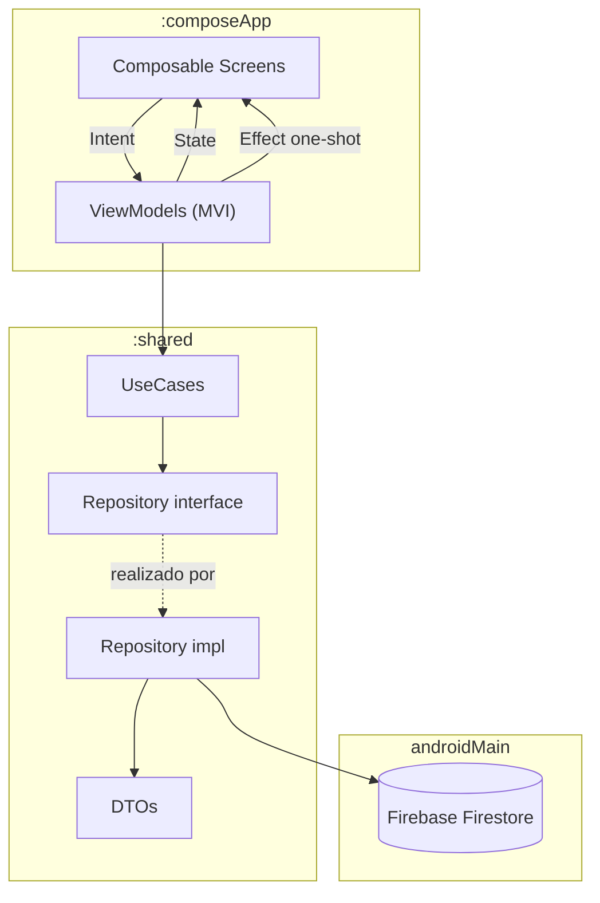
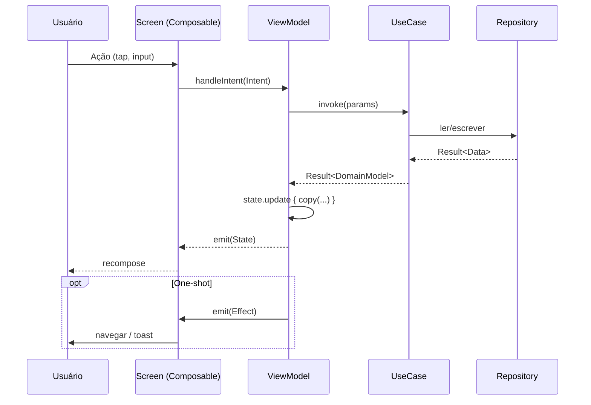

# Arquitetura — Sprena

> Este documento descreve a arquitetura **vigente** do projeto. Para diretrizes de codificação dirigidas à IA, ver [CLAUDE.md](./CLAUDE.md).

## Visão geral

Sprena segue **Clean Architecture** com **MVI** (Model-View-Intent) na camada de apresentação. Multi-módulo via Kotlin Multiplatform: o módulo `shared` contém domínio e dados (puro Kotlin + adapters Android), e o módulo `composeApp` contém UI + ViewModels + DI raiz.



## Camadas

| Camada | Local | Conteúdo |
|--------|-------|----------|
| Presentation | `composeApp/commonMain/.../presentation/<feature>` | Screen + ViewModel + State + Intent + Effect |
| Domain | `shared/.../<feature>/domain` | Model, UseCase, Repository (interface), Validation |
| Data | `shared/.../<feature>/data` (commonMain) + `shared/androidMain/.../<feature>/data/repository` | DTO + Repository impl (Firestore) |
| Core | `shared/.../core` | Contratos MVI, ValidationResult, módulos Koin |
| Platform | `composeApp/androidMain` | Activity, Application, bindings de plataforma |

## Fluxo MVI



Contrato base em `shared/.../core/mvi/MviViewModel.kt`:

```kotlin
interface MviViewModel<STATE : UiState, INTENT : UiIntent, EFFECT : UiEffect> {
    val state: StateFlow<STATE>
    val effects: SharedFlow<EFFECT>
    fun handleIntent(intent: INTENT)
}
```

## Features implementadas

| Feature | Domain | Data | Notas |
|---------|--------|------|-------|
| auth | Sim | Mock | A migrar para Firebase Auth em F1 |
| sportclient | Sim | Firestore | CPF/phone hoje em plain text — corrigir em F1 |
| kanban | Só validation | Não | Lógica vive no VM — completar em F2 |
| financial | Só validation | Não | Idem |
| bar | Só validation | Não | Idem |
| menu | Só validation | Não | Idem |
| eventos | Só presentation | Não | Sem shared/domain ainda |

## Decisões arquiteturais (ADRs leves)

### ADR-001: Koin sobre Hilt
Aceito. Razão: KMP-friendly; Hilt depende de Dagger + AGP. Trade-off: menos verificação em compile-time.

### ADR-002: Firebase Firestore como backend
Aceito. Razão: real-time sync, offline persistence nativa, sem backend próprio para manter. Trade-off: vendor lock-in e custo por leitura/escrita.

### ADR-003: MVI em vez de MVVM puro
Aceito. Razão: estado único imutável reduz bugs de race condition; intents tornam ações explícitas e testáveis. Trade-off: mais boilerplate.

### ADR-004: KMP com iOS adiado
Aceito. Targets iOS comentados (`composeApp/build.gradle.kts:21-23`). Razão: foco em Android-first para MVP. Reativar em F6.

### ADR-005: Docker como sandbox local, CI em Gradle direto
Aceito. Razão: Docker isola dev local mas adiciona latência em CI; GH Actions roda Gradle direto com cache nativo.

## Segurança

Decisões de segurança e endurecimento de build estão documentadas em [SECURITY.md](./SECURITY.md). Fases aplicadas:

- **F1.1** — minificação R8, bloqueio de backup, network security config, `FLAG_SECURE`.
- **F1.2** — logging seguro (Napier + Crashlytics) com sanitização de PII (`PiiMasker`/`PiiScrubber`) e instrumentação inicial de Repositories críticos.

Próximas sub-fases de F1 adicionarão Firebase Auth (F1.3), Firestore Rules + App Check (F1.4) e baseline LGPD (F1.5).
