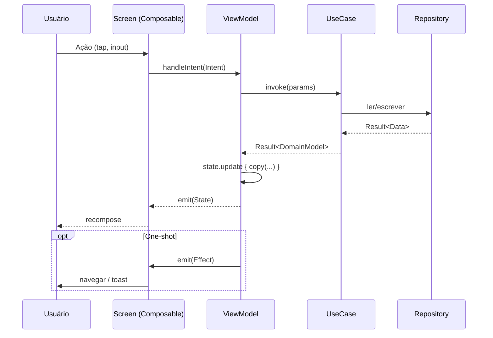

# F0 — Fundação documental + tooling — Implementation Plan

> **For agentic workers:** REQUIRED SUB-SKILL: Use superpowers:subagent-driven-development (recommended) or superpowers:executing-plans to implement this plan task-by-task. Steps use checkbox (`- [ ]`) syntax for tracking.

**Goal:** Estabelecer a fundação documental e de tooling do projeto Sprena — docs (.md) de governança, static analysis (detekt + ktlint) e CI no GitHub Actions — sem alterar código de feature.

**Architecture:** F0 é puramente de configuração/documentação. Static analysis aplicado via root `build.gradle.kts` com `subprojects {}` para uniformidade. CI roda em Ubuntu via `actions/setup-java@v4` + `gradle/actions/setup-gradle@v4`, executando build, test, detekt e ktlint em PRs e push para main/master. Docker compose já existente permanece como sandbox local; CI usa Gradle direto (mais rápido, sem custo de manter daemon Docker).

**Tech Stack:** Detekt 1.23.7 (Kotlin static analysis), ktlint-gradle 12.1.2 (jlleitschuh wrapper para ktlint 1.4.1), GitHub Actions, Markdown, Mermaid.

---

## Estrutura de arquivos

**Novos:**
- `README.md` — onboarding, badges, comandos básicos
- `ARCHITECTURE.md` — diagrama Mermaid de módulos + fluxo MVI + decisões arquiteturais
- `CONTRIBUTING.md` — setup local, Docker, convenções de commit, fluxo de PR
- `ROADMAP.md` — visão pública sintetizada do roadmap aprovado (F0 → F6)
- `.editorconfig` — coerência de encoding/whitespace entre IDEs
- `config/detekt/detekt.yml` — configuração detekt (gerada via `detektGenerateConfig` e ajustada)
- `.github/CODEOWNERS` — donos do código (atual: @PeCruz como único reviewer)
- `.github/pull_request_template.md` — template de PR
- `.github/workflows/ci.yml` — pipeline build + test + detekt + ktlint

**Modificados:**
- `gradle/libs.versions.toml` — adicionar versões e plugin aliases para detekt e ktlint
- `build.gradle.kts` (root) — aplicar detekt + ktlint em `subprojects {}`
- `.gitignore` — adicionar `config/detekt/baseline.xml` se gerado, e relatórios

---

## Task 1: Adicionar plugins de detekt e ktlint ao Version Catalog

**Files:**
- Modify: `gradle/libs.versions.toml`

- [ ] **Step 1: Adicionar versões e plugin aliases**

Editar `gradle/libs.versions.toml`. Em `[versions]`, depois da linha `kotlinx-serialization = "1.7.3"` (linha 23), adicionar:

```toml

# --- Static Analysis ---
detekt = "1.23.7"
ktlint-gradle = "12.1.2"
```

Em `[plugins]`, depois da linha `google-services = ...` (linha 67), adicionar:

```toml
detekt = { id = "io.gitlab.arturbosch.detekt", version.ref = "detekt" }
ktlint = { id = "org.jlleitschuh.gradle.ktlint", version.ref = "ktlint-gradle" }
```

- [ ] **Step 2: Verificar que o catálogo continua válido**

Run: `./gradlew help --quiet`
Expected: comando completa sem erros de "Unknown plugin" / "Unresolved reference".

- [ ] **Step 3: Commit**

```bash
git add gradle/libs.versions.toml
git commit -m "chore(build): add detekt and ktlint to version catalog"
```

---

## Task 2: Aplicar detekt no root e configurar para subprojects

**Files:**
- Modify: `build.gradle.kts` (root)

- [ ] **Step 1: Aplicar plugin detekt e configurar**

Substituir o conteúdo INTEIRO de `build.gradle.kts` (root) por:

```kotlin
plugins {
    alias(libs.plugins.android.application) apply false
    alias(libs.plugins.android.library) apply false
    alias(libs.plugins.kotlin.multiplatform) apply false
    alias(libs.plugins.compose.multiplatform) apply false
    alias(libs.plugins.compose.compiler) apply false
    alias(libs.plugins.kotlin.serialization) apply false
    alias(libs.plugins.google.services) apply false
    alias(libs.plugins.detekt)
}

subprojects {
    apply(plugin = rootProject.libs.plugins.detekt.get().pluginId)

    extensions.configure<io.gitlab.arturbosch.detekt.extensions.DetektExtension> {
        toolVersion = rootProject.libs.versions.detekt.get()
        config.setFrom(rootProject.files("config/detekt/detekt.yml"))
        buildUponDefaultConfig = true
        autoCorrect = false
        parallel = true
    }

    tasks.withType<io.gitlab.arturbosch.detekt.Detekt>().configureEach {
        jvmTarget = "17"
        reports {
            html.required.set(true)
            xml.required.set(true)
            sarif.required.set(true)
            md.required.set(false)
            txt.required.set(false)
        }
    }
}
```

- [ ] **Step 2: Gerar configuração padrão do detekt**

Run: `./gradlew detektGenerateConfig`
Expected: cria `config/detekt/detekt.yml` no root.

- [ ] **Step 3: Verificar que detekt task existe**

Run: `./gradlew :composeApp:detekt --dry-run`
Expected: imprime `:composeApp:detekt SKIPPED` (dry-run só lista as tasks).

- [ ] **Step 4: Commit**

```bash
git add build.gradle.kts config/detekt/detekt.yml
git commit -m "chore(quality): apply detekt to all subprojects with shared config"
```

---

## Task 3: Customizar detekt.yml para o projeto

**Files:**
- Modify: `config/detekt/detekt.yml`

- [ ] **Step 1: Ajustar regras críticas**

Abrir `config/detekt/detekt.yml`. Localizar a seção `complexity:` e ajustar:

```yaml
complexity:
  LongMethod:
    active: true
    threshold: 60
  LongParameterList:
    active: true
    functionThreshold: 7
    constructorThreshold: 8
  TooManyFunctions:
    active: true
    thresholdInFiles: 25
    thresholdInClasses: 20
    thresholdInInterfaces: 15
    thresholdInObjects: 15
    thresholdInEnums: 15
```

Localizar `style:` e habilitar:

```yaml
style:
  MagicNumber:
    active: true
    ignoreNumbers: ['-1', '0', '1', '2', '100']
    ignoreHashCodeFunction: true
    ignorePropertyDeclaration: true
    ignoreCompanionObjectPropertyDeclaration: true
    ignoreConstantDeclaration: true
    ignoreEnums: true
    ignoreRanges: true
  ForbiddenComment:
    active: true
    comments:
      - reason: 'TODOs devem virar issues no GitHub'
        value: 'TODO:'
      - reason: 'FIXMEs devem virar issues no GitHub'
        value: 'FIXME:'
```

- [ ] **Step 2: Rodar detekt e gerar baseline (suprimir débito atual)**

Run: `./gradlew detektBaseline`
Expected: cria `config/detekt/baseline.xml` por módulo (ou no root). Issues atuais ficam suprimidas até refactor explícito.

- [ ] **Step 3: Configurar baseline no extension**

Em `build.gradle.kts` (root), dentro do bloco `extensions.configure<DetektExtension> { ... }`, adicionar a linha:

```kotlin
        baseline = rootProject.file("config/detekt/baseline.xml")
```

(coloque após `parallel = true`)

- [ ] **Step 4: Rodar detekt no projeto inteiro**

Run: `./gradlew detekt`
Expected: BUILD SUCCESSFUL. Reports em `*/build/reports/detekt/`.

- [ ] **Step 5: Commit**

```bash
git add config/detekt/detekt.yml config/detekt/baseline.xml build.gradle.kts
git commit -m "chore(quality): tune detekt rules and snapshot baseline"
```

---

## Task 4: Aplicar ktlint em subprojects

**Files:**
- Modify: `build.gradle.kts` (root)

- [ ] **Step 1: Adicionar plugin ktlint no root**

Em `build.gradle.kts` (root), no bloco `plugins { ... }`, adicionar (após `alias(libs.plugins.detekt)`):

```kotlin
    alias(libs.plugins.ktlint)
```

Após o bloco `subprojects { ... apply detekt ... }`, adicionar um segundo bloco subprojects para ktlint:

```kotlin
subprojects {
    apply(plugin = rootProject.libs.plugins.ktlint.get().pluginId)

    extensions.configure<org.jlleitschuh.gradle.ktlint.KtlintExtension> {
        version.set("1.4.1")
        android.set(true)
        ignoreFailures.set(false)
        reporters {
            reporter(org.jlleitschuh.gradle.ktlint.reporter.ReporterType.PLAIN)
            reporter(org.jlleitschuh.gradle.ktlint.reporter.ReporterType.CHECKSTYLE)
            reporter(org.jlleitschuh.gradle.ktlint.reporter.ReporterType.SARIF)
        }
        filter {
            exclude("**/generated/**")
            exclude("**/build/**")
        }
    }
}
```

- [ ] **Step 2: Verificar tasks ktlint**

Run: `./gradlew :composeApp:ktlintCheck --dry-run`
Expected: imprime tarefas `:composeApp:ktlintMainSourceSetCheck` e similares.

- [ ] **Step 3: Rodar ktlintFormat para normalizar o código existente**

Run: `./gradlew ktlintFormat`
Expected: BUILD SUCCESSFUL. Alguns arquivos podem ser reformatados.

- [ ] **Step 4: Rodar ktlintCheck para confirmar**

Run: `./gradlew ktlintCheck`
Expected: BUILD SUCCESSFUL com 0 violations.

- [ ] **Step 5: Commit**

```bash
git add build.gradle.kts
git add -u
git commit -m "chore(quality): apply ktlint and auto-format existing sources"
```

---

## Task 5: Criar .editorconfig

**Files:**
- Create: `.editorconfig`

- [ ] **Step 1: Criar arquivo**

Conteúdo de `.editorconfig`:

```ini
root = true

[*]
charset = utf-8
end_of_line = lf
insert_final_newline = true
trim_trailing_whitespace = true
indent_style = space
indent_size = 4

[*.{kt,kts}]
ktlint_standard_no-wildcard-imports = enabled
ktlint_standard_filename = enabled
max_line_length = 140

[*.{yml,yaml,json,toml}]
indent_size = 2

[*.md]
trim_trailing_whitespace = false
max_line_length = off

[Makefile]
indent_style = tab
```

- [ ] **Step 2: Rodar ktlintCheck para confirmar conformidade**

Run: `./gradlew ktlintCheck`
Expected: BUILD SUCCESSFUL.

- [ ] **Step 3: Commit**

```bash
git add .editorconfig
git commit -m "chore: add .editorconfig for IDE consistency"
```

---

## Task 6: Criar README.md

**Files:**
- Create: `README.md`

- [ ] **Step 1: Criar README**

Conteúdo de `README.md`:

````markdown
# Sprena

Aplicativo de gestão de quadras esportivas de areia (Futevôlei, Beach Tennis, Vôlei de Praia).

Construído com **Kotlin Multiplatform** + **Compose Multiplatform** seguindo Clean Architecture + MVI.

## Stack

- Kotlin 2.1.10 · Compose Multiplatform 1.7.3 · Material 3
- Koin 4.0.2 (DI)
- Firebase Firestore 34.x (backend)
- Coroutines 1.9.0 · Flow · StateFlow

## Requisitos

- JDK 17+
- Android SDK 35 (compile) / minSdk 26
- Docker (opcional — para builds isolados)

## Setup

```bash
git clone https://github.com/PeCruz/Kanoas.git
cd Kanoas
./gradlew :composeApp:assembleDebug
```

Coloque o arquivo `google-services.json` em `composeApp/` (não commitado — solicite ao mantenedor).

## Comandos comuns

| Tarefa | Local | Docker (sandbox) |
|--------|-------|------------------|
| Build debug | `./gradlew :composeApp:assembleDebug` | `docker compose run --rm android-build` |
| Testes unitários | `./gradlew :composeApp:testDebugUnitTest :shared:testDebugUnitTest` | `docker compose run --rm android-test` |
| Lint Android | `./gradlew :composeApp:lint` | `docker compose run --rm android-lint` |
| Static analysis | `./gradlew detekt ktlintCheck` | — |
| Format Kotlin | `./gradlew ktlintFormat` | — |

## Documentação

- [ARCHITECTURE.md](./ARCHITECTURE.md) — Diagrama de módulos e fluxo MVI
- [CONTRIBUTING.md](./CONTRIBUTING.md) — Como contribuir
- [ROADMAP.md](./ROADMAP.md) — Roadmap de evolução
- [CLAUDE.md](./CLAUDE.md) — Padrões e diretrizes para IA assistente

## Licença

Proprietária — todos os direitos reservados.
````

- [ ] **Step 2: Commit**

```bash
git add README.md
git commit -m "docs: add README with setup, stack, and commands"
```

---

## Task 7: Criar ARCHITECTURE.md

**Files:**
- Create: `ARCHITECTURE.md`

- [ ] **Step 1: Criar documento**

Conteúdo de `ARCHITECTURE.md`:

````markdown
# Arquitetura — Sprena

> Este documento descreve a arquitetura **vigente** do projeto. Para diretrizes de codificação dirigidas à IA, ver [CLAUDE.md](./CLAUDE.md).

## Visão geral

Sprena segue **Clean Architecture** com **MVI** (Model-View-Intent) na camada de apresentação. Multi-módulo via Kotlin Multiplatform: o módulo `shared` contém domínio e dados (puro Kotlin + adapters Android), e o módulo `composeApp` contém UI + ViewModels + DI raiz.

```mermaid
flowchart TB
    subgraph composeApp[":composeApp"]
        UI["Composable Screens"]
        VM["ViewModels (MVI)"]
        UI -->|Intent| VM
        VM -->|State| UI
        VM -->|Effect (one-shot)| UI
    end

    subgraph shared[":shared"]
        UC["UseCases"]
        REPO_IF["Repository (interface)"]
        REPO_IMPL["Repository (impl)"]
        DTO["DTOs"]
        VM --> UC
        UC --> REPO_IF
        REPO_IF -.realizado por.-> REPO_IMPL
        REPO_IMPL --> DTO
    end

    subgraph platform["androidMain"]
        FIRESTORE[("Firebase Firestore")]
        REPO_IMPL --> FIRESTORE
    end
```

## Camadas

| Camada | Local | Conteúdo |
|--------|-------|----------|
| Presentation | `composeApp/commonMain/.../presentation/<feature>` | Screen + ViewModel + State + Intent + Effect |
| Domain | `shared/.../<feature>/domain` | Model, UseCase, Repository (interface), Validation |
| Data | `shared/.../<feature>/data` (commonMain) + `shared/androidMain/.../<feature>/data/repository` | DTO + Repository impl (Firestore) |
| Core | `shared/.../core` | Contratos MVI, ValidationResult, módulos Koin |
| Platform | `composeApp/androidMain` | Activity, Application, bindings de plataforma |

## Fluxo MVI



Contrato base em `shared/.../core/mvi/MviViewModel.kt`:

```kotlin
interface MviViewModel<STATE : UiState, INTENT : UiIntent, EFFECT : UiEffect> {
    val state: StateFlow<STATE>
    val effects: SharedFlow<EFFECT>
    fun handleIntent(intent: INTENT)
}
```

## Features implementadas

| Feature | Domain | Data | Notas |
|---------|--------|------|-------|
| auth | ✅ | ✅ (mock) | A migrar para Firebase Auth em F1 |
| sportclient | ✅ | ✅ (Firestore) | CPF/phone hoje em plain text — corrigir em F1 |
| kanban | ⚠ só validation | ❌ | Lógica vive no VM — completar em F2 |
| financial | ⚠ só validation | ❌ | Idem |
| bar | ⚠ só validation | ❌ | Idem |
| menu | ⚠ só validation | ❌ | Idem |
| eventos | ✅ presentation | ❌ | Sem shared/domain ainda |

## Decisões arquiteturais (ADRs leves)

### ADR-001: Koin sobre Hilt
Aceito. Razão: KMP-friendly; Hilt depende de Dagger + AGP. Trade-off: menos verificação em compile-time.

### ADR-002: Firebase Firestore como backend
Aceito. Razão: real-time sync, offline persistence nativa, sem backend próprio para manter. Trade-off: vendor lock-in e custo por leitura/escrita.

### ADR-003: MVI em vez de MVVM puro
Aceito. Razão: estado único imutável reduz bugs de race condition; intents tornam ações explícitas e testáveis. Trade-off: mais boilerplate.

### ADR-004: KMP com iOS adiado
Aceito. Targets iOS comentados (`composeApp/build.gradle.kts:21-23`). Razão: foco em Android-first para MVP. Reativar em F6.

### ADR-005: Docker como sandbox local, CI em Gradle direto
Aceito. Razão: Docker isola dev local mas adiciona latência em CI; GH Actions roda Gradle direto com cache nativo.
````

- [ ] **Step 2: Commit**

```bash
git add ARCHITECTURE.md
git commit -m "docs: add ARCHITECTURE.md with module diagram and ADRs"
```

---

## Task 8: Criar CONTRIBUTING.md

**Files:**
- Create: `CONTRIBUTING.md`

- [ ] **Step 1: Criar documento**

Conteúdo de `CONTRIBUTING.md`:

````markdown
# Contribuindo com o Sprena

## Setup local

1. JDK 17 instalado (`java -version` deve mostrar 17.x)
2. Android SDK 35 instalado via Android Studio ou `sdkmanager`
3. Clonar e abrir no Android Studio: `File → Open → Kanoas`
4. Sincronizar Gradle (Android Studio faz automaticamente)

Para builds isolados, usar Docker:

```bash
docker compose run --rm android-build
docker compose run --rm android-test
docker compose run --rm android-lint
```

## Antes de abrir PR

```bash
./gradlew ktlintFormat              # auto-formata
./gradlew detekt ktlintCheck        # verifica estilo
./gradlew :composeApp:testDebugUnitTest :shared:testDebugUnitTest
./gradlew :composeApp:assembleDebug # garante que compila
```

CI roda os mesmos comandos. PRs com checks falhando não merge.

## TDD obrigatório

Antes de implementar qualquer feature ou correção:

1. Escrever o teste falhando primeiro.
2. Rodar para confirmar que falha pelo motivo certo.
3. Implementar o mínimo para passar.
4. Refatorar.
5. Commit em incrementos pequenos.

Stack de testes:
- `kotlin-test` (assertions)
- `Turbine` (Flow)
- `MockK` (apenas `androidUnitTest` — não em `commonTest`)

## Convenção de commits

Formato:

```
tipo(escopo): descrição curta no imperativo

corpo opcional explicando o porquê (não o quê)
```

Tipos permitidos: `feat`, `fix`, `test`, `refactor`, `docs`, `chore`, `style`, `perf`, `build`, `ci`.

Exemplos:
- `feat(financial): add transaction filter by date range`
- `fix(login): handle network timeout without crashing`
- `chore(build): bump kotlin to 2.1.20`

## Fluxo de PR

1. Branch a partir de `master`: `feature/<short-name>`, `fix/<short-name>`, `chore/<short-name>`.
2. Commits pequenos e granulares (idealmente um por unidade lógica).
3. Push e abrir PR usando o template (`.github/pull_request_template.md`).
4. Aguardar CI verde + revisão de @PeCruz (CODEOWNERS).
5. Squash & merge.

## Padrões do projeto

Padrões obrigatórios em [CLAUDE.md](./CLAUDE.md) (MVI, Koin, restrições). Arquitetura geral em [ARCHITECTURE.md](./ARCHITECTURE.md). Não usar Hilt, Supabase, Ktor (ver "Restrições" no CLAUDE.md).
````

- [ ] **Step 2: Commit**

```bash
git add CONTRIBUTING.md
git commit -m "docs: add CONTRIBUTING with setup, TDD and commit conventions"
```

---

## Task 9: Criar ROADMAP.md

**Files:**
- Create: `ROADMAP.md`

- [ ] **Step 1: Criar documento**

Conteúdo de `ROADMAP.md`:

````markdown
# Roadmap — Sprena

Roadmap de evolução do MVP até nível production-ready. As fases são independentes e podem ser executadas em qualquer ordem, mas a numeração reflete a recomendação por risco mitigado.

## ✅ F0 — Fundação documental + tooling
- Docs: README, ARCHITECTURE, CONTRIBUTING, ROADMAP
- Static analysis: detekt + ktlint
- CI: GitHub Actions (build + test + lint)
- Hygiene: CODEOWNERS, PR template, .editorconfig

## F1 — Segurança crítica + LGPD baseline
- Build hardening: R8/Proguard, `allowBackup=false`, networkSecurityConfig
- Firestore Security Rules + Firebase App Check
- Auth real (Firebase Auth) substituindo o mock; sessão em DataStore criptografado
- Consentimento LGPD + política de privacidade + masking de CPF
- FLAG_SECURE em telas sensíveis
- Logging seguro (Napier + Crashlytics) com sanitização de PII

## F2 — Completar Clean Architecture
- Para cada feature (`kanban`, `financial`, `bar`, `menu`):
  - Domain (model, usecase, repository interface)
  - Data (DTO + repository impl Firestore)
  - Refactor de ViewModels para consumir UseCases
- RBAC enforcado via `RoleGuardedUseCase` decorator (financeiro restrito a ADM/MOD)
- TDD obrigatório de UseCases e Repositories

## F3 — Design system + UX
- Componentes reutilizáveis em `core/ui/components`
- `UiStateScaffold` unificado (loading/error/empty/success)
- Paleta esportiva (revisão de Color.kt)
- Microinterações e transições
- Documentação em COMPONENTS.md + THEME_GUIDE.md

## F4 — Performance + Offline-first
- Firestore offline persistence ativado
- `derivedStateOf` em filtros computados
- Baseline Profile para cold start
- PERFORMANCE.md com checklist por PR

## F5 — Observabilidade + Analytics LGPD-aware
- Firebase Analytics com Consent Mode v2 (default = denied)
- Error tracking (Crashlytics ou Sentry KMP) com sanitização
- Eventos documentados em ANALYTICS.md

## F6 — Pós-MVP
- iOS target ativado
- Navigation type-safe (kotlinx.serialization routes)
- Feature flags (Remote Config)
- Exportação de relatórios financeiros (PDF/CSV)
- Biometria (BiometricPrompt)
- Settings: UI admin para roles e permissões

---

**Status:** F0 em execução. Demais fases pendentes de priorização do mantenedor.
````

- [ ] **Step 2: Commit**

```bash
git add ROADMAP.md
git commit -m "docs: add public ROADMAP with F0-F6 phases"
```

---

## Task 10: Criar CODEOWNERS e PR template

**Files:**
- Create: `.github/CODEOWNERS`
- Create: `.github/pull_request_template.md`

- [ ] **Step 1: Criar CODEOWNERS**

Conteúdo de `.github/CODEOWNERS`:

```
# Sprena CODEOWNERS
# Linha abaixo: tudo é revisado por @PeCruz
*       @PeCruz

# Configurações sensíveis exigem revisão extra (placeholder para quando o time crescer)
/composeApp/build.gradle.kts        @PeCruz
/shared/build.gradle.kts            @PeCruz
/gradle/libs.versions.toml          @PeCruz
/.github/                           @PeCruz
/firestore.rules                    @PeCruz
```

- [ ] **Step 2: Criar PR template**

Conteúdo de `.github/pull_request_template.md`:

```markdown
## O que este PR faz

<!-- Resumo objetivo em 1-3 linhas. Foco no "porquê", não no "o quê" (o diff mostra o quê). -->

## Tipo

- [ ] feat (nova funcionalidade)
- [ ] fix (correção de bug)
- [ ] refactor (sem mudança de comportamento)
- [ ] test (adição de testes)
- [ ] docs
- [ ] chore / build / ci

## Checklist

- [ ] Testes adicionados/atualizados (TDD)
- [ ] `./gradlew ktlintFormat detekt ktlintCheck` passa local
- [ ] `./gradlew :composeApp:testDebugUnitTest :shared:testDebugUnitTest` passa local
- [ ] `./gradlew :composeApp:assembleDebug` compila
- [ ] Sem novos warnings de lint Android
- [ ] CLAUDE.md / ARCHITECTURE.md atualizados se padrões mudaram
- [ ] Dados sensíveis (CPF, telefone, token) tratados conforme LGPD/SECURITY.md

## Como testar

<!-- Passos manuais para validar a mudança no app rodando -->

## Screenshots (se UI)

<!-- Light + Dark mode -->

## Riscos / pontos de atenção

<!-- O que pode quebrar. O que NÃO foi testado. -->
```

- [ ] **Step 3: Commit**

```bash
git add .github/CODEOWNERS .github/pull_request_template.md
git commit -m "chore(ci): add CODEOWNERS and PR template"
```

---

## Task 11: Criar GitHub Actions CI

**Files:**
- Create: `.github/workflows/ci.yml`

- [ ] **Step 1: Criar workflow**

Conteúdo de `.github/workflows/ci.yml`:

```yaml
name: CI

on:
  push:
    branches: [master, main]
  pull_request:
    branches: [master, main]

concurrency:
  group: ci-${{ github.workflow }}-${{ github.ref }}
  cancel-in-progress: ${{ github.event_name == 'pull_request' }}

jobs:
  build-and-test:
    name: Build · Test · Static Analysis
    runs-on: ubuntu-latest
    timeout-minutes: 30

    steps:
      - name: Checkout
        uses: actions/checkout@v4

      - name: Set up JDK 17
        uses: actions/setup-java@v4
        with:
          distribution: 'temurin'
          java-version: '17'

      - name: Set up Gradle
        uses: gradle/actions/setup-gradle@v4
        with:
          cache-read-only: ${{ github.event_name == 'pull_request' && github.head_ref != 'master' }}

      - name: Stub google-services.json
        # google-services.json não é commitado. Para CI, cria um stub que satisfaz o plugin
        # mas aponta para um project ID falso — basta para o build compilar.
        run: |
          cat > composeApp/google-services.json <<'JSON'
          {
            "project_info": {
              "project_number": "000000000000",
              "project_id": "sprena-ci",
              "storage_bucket": "sprena-ci.appspot.com"
            },
            "client": [
              {
                "client_info": {
                  "mobilesdk_app_id": "1:000000000000:android:0000000000000000",
                  "android_client_info": { "package_name": "br.com.sprena" }
                },
                "oauth_client": [],
                "api_key": [{ "current_key": "AIzaSy_CI_STUB_KEY_NOT_REAL_0000000000" }],
                "services": { "appinvite_service": { "other_platform_oauth_client": [] } }
              }
            ],
            "configuration_version": "1"
          }
          JSON

      - name: ktlint check
        run: ./gradlew ktlintCheck --no-daemon

      - name: detekt
        run: ./gradlew detekt --no-daemon

      - name: Unit tests
        run: ./gradlew :composeApp:testDebugUnitTest :shared:testDebugUnitTest --no-daemon

      - name: Android lint
        run: ./gradlew :composeApp:lint --no-daemon

      - name: Assemble debug
        run: ./gradlew :composeApp:assembleDebug --no-daemon

      - name: Upload reports on failure
        if: failure()
        uses: actions/upload-artifact@v4
        with:
          name: reports-${{ github.run_id }}
          path: |
            **/build/reports/
            **/build/test-results/
          retention-days: 7
```

- [ ] **Step 2: Validar sintaxe YAML local**

Run: `python -c "import yaml,sys; yaml.safe_load(open('.github/workflows/ci.yml'))"` (ou usar GitHub action linter)
Expected: comando completa sem erro.

- [ ] **Step 3: Commit**

```bash
git add .github/workflows/ci.yml
git commit -m "ci: add GitHub Actions pipeline (ktlint, detekt, tests, lint, assemble)"
```

---

## Task 12: Atualizar .gitignore para outputs de análise

**Files:**
- Modify: `.gitignore`

- [ ] **Step 1: Adicionar entradas**

Editar `.gitignore`. Após a linha `*.class` (linha 28), adicionar:

```gitignore

# --- Static Analysis ---
# Mantemos config/detekt/detekt.yml e baseline.xml versionados.
# Ignoramos apenas reports gerados.
**/build/reports/
.kotlin/

# --- CI ---
# Stub google-services.json é criado pelo CI; nunca commitar
# (já coberto pela regra google-services.json acima, mas explicitando)
```

- [ ] **Step 2: Verificar que arquivos importantes ainda são trackeados**

Run: `git check-ignore -v config/detekt/detekt.yml`
Expected: comando retorna exit 1 (não ignorado).

Run: `git check-ignore -v composeApp/build/reports/detekt/detekt.html`
Expected: exit 0 (ignorado).

- [ ] **Step 3: Commit**

```bash
git add .gitignore
git commit -m "chore: ignore static analysis report outputs"
```

---

## Task 13: Verificação end-to-end local

**Files:** nenhum.

- [ ] **Step 1: Rodar pipeline completo localmente (espelhando CI)**

```bash
./gradlew ktlintCheck detekt :composeApp:testDebugUnitTest :shared:testDebugUnitTest :composeApp:lint :composeApp:assembleDebug --no-daemon
```

Expected: BUILD SUCCESSFUL. Todos os jobs verdes.

- [ ] **Step 2: Inspecionar relatórios**

Verificar manualmente que os arquivos existem:
- `composeApp/build/reports/detekt/detekt.html`
- `composeApp/build/reports/ktlint/`
- `composeApp/build/reports/lint-results-debug.html`
- `composeApp/build/test-results/testDebugUnitTest/`

- [ ] **Step 3: Sem mudanças a commitar** (verificação pura).

---

## Task 14: Smoke test do CI no GitHub

**Files:** nenhum.

- [ ] **Step 1: Push da branch F0 para origin**

```bash
git push -u origin <branch-name>
```

(Se trabalhando em `master` diretamente, pular para Step 2.)

- [ ] **Step 2: Abrir PR de teste**

Via `gh pr create` ou UI do GitHub. Título: `F0: foundation (docs + tooling + CI)`. Usar o template.

- [ ] **Step 3: Verificar que o workflow rodou**

Run: `gh run list --workflow=ci.yml --limit 1`
Expected: status `completed` e conclusão `success`.

Se vermelho:
- Baixar reports do artifact upload
- Corrigir o issue
- Commit + push
- Repetir

- [ ] **Step 4: Merge do PR (após verde)**

```bash
gh pr merge --squash
```

---

## Verificação geral da fase

Após Task 14:

- ✅ `./gradlew detekt ktlintCheck` roda sem erros
- ✅ CI no GitHub verde em PR e push para master
- ✅ Docs renderizam corretamente: abrir README.md, ARCHITECTURE.md, ROADMAP.md, CONTRIBUTING.md no GitHub e checar Mermaid renderizado
- ✅ PR template aparece automaticamente ao abrir novo PR
- ✅ Próxima fase (F1) pode iniciar — tooling cobre as mudanças de build/security que ela trará
